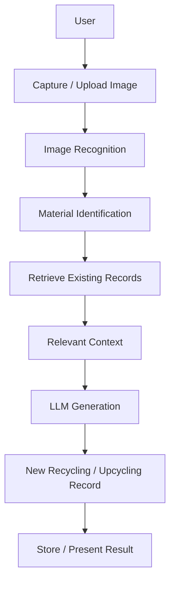
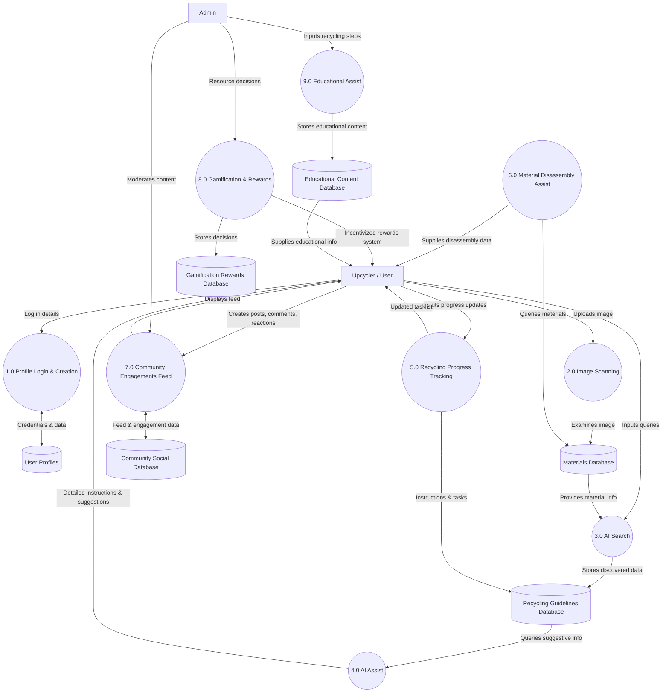

# Waste-to-Worth

### Environmentally Transformative Use of Image Recognition and Artificial Intelligence

Waste-to-Worth is an AI-powered web and mobile application designed to make recycling and upcycling more accessible by helping users identify waste materials and discover practical ways to recycle, dispose of, or transform them into useful products.

The system combines image recognition, Retrieval-Augmented Generation (RAG), and a knowledge-based information system to provide users with contextually relevant recycling and upcycling recommendations.

> 🏆 **3rd Best Capstone Project Overall — Department Level**

---

## Overview

Recycling and upcycling often require users to research what materials they have, determine whether those materials can be recycled, and find appropriate ways to dispose of or repurpose them.

Waste-to-Worth aims to simplify this process through artificial intelligence.

Users can scan waste materials through the application. The system uses image recognition to identify the material, retrieves relevant existing recycling and upcycling records, and provides this information as context to an LLM. The LLM then generates a new, contextually relevant recycling or upcycling record based on the retrieved knowledge.

This approach allows the system to generate new recommendations while grounding its outputs in existing recycling and upcycling information.

---

## AI & RAG Pipeline

The core AI workflow follows a retrieval-augmented generation architecture:

## System Architecture

The following Data Flow Diagram (DFD) maps out the complete architecture of the **Waste-to-Worth** platform. It illustrates the interactions between the users (Upcycler and Admin), the core system processes, and the underlying databases.

### Pipeline Workflow

1.  **Image Recognition:** The user captures or uploads an image of a waste material. The image recognition component processes the image and identifies the material or material category.
    
2.  **Knowledge Retrieval:** Once the material is identified, the system retrieves relevant existing recycling and upcycling records from its knowledge base to provide contextual information.
    
3.  **Retrieval-Augmented Generation (RAG):** The retrieved records are provided as context to an LLM, which uses this information to generate a new recycling or upcycling record relevant to the identified waste material.
    
4.  **Generated Record:** The result provides users with a new, tailored recommendation or idea grounded in existing knowledge rather than relying solely on the LLM's general knowledge.
    

Key Features
------------

*   ♻️ **AI-Powered Waste Recognition:** Uses image recognition to assist users in identifying waste materials from captured or uploaded images.
    
*   🤖 **Retrieval-Augmented Generation:** Uses retrieved recycling and upcycling records as context for an LLM to generate new, relevant recommendations.
    
*   🔎 **Knowledge Retrieval:** Retrieves existing records related to identified waste materials to provide context for AI-generated results.
    
*   🔄 **Recycling and Disposal Guidance:** Provides information and recommendations on appropriate ways to handle identified waste materials.
    
*   🛠️ **AI-Assisted Upcycling:** Generates new upcycling ideas and recommendations based on existing knowledge and the identified material.
    
*   📱 **Web and Mobile Experience:** Provides an accessible interface for interacting with the application's AI and waste management features.
    
*   🎮 **Gamification:** Uses gamification elements to encourage continued user engagement with recycling and upcycling activities.
    
*   📊 **User Activity Tracking:** Allows users to track scanned materials, recycling activities, completed projects, and disposal records.
    

## Technology Stack

| Category | Technology / Tools |
| :--- | :--- |
| **Frontend** | React Native |
| **Backend** | Python, Flask |
| **Database** | Firebase Firestore (NoSQL) |
| **Artificial Intelligence** | Image Recognition, LLM, RAG Architecture |
| **Deployment** | Hostinger, Android (APK) |

My Role
-------

My responsibilities included:

*   System architecture and design
    
*   Frontend and mobile application development
    
*   Backend API development
    
*   Database design and integration
    
*   Image recognition integration & RAG pipeline implementation
    
*   LLM integration and knowledge retrieval system
    
*   AI-generated recycling and upcycling content pipeline
    
*   User interface and experience design (UI/UX)
    
*   Feature implementation, testing, and deployment
    

Project Recognition & Context
-----------------------------

> 🏆 **3rd Best Capstone Project Overall — Department Level**

*   **Academic Institution:** Developed as a capstone project for the Bachelor of Science in Information Technology program at **San Beda College Alabang**.
    
*   **UN Sustainable Development Goals:** Aligns with **SDG 12: Responsible Consumption and Production**, focusing on encouraging responsible waste management, recycling, and sustainable consumption practices.
    
*   **Project Status:** Academic Capstone Project (tested with users during its pilot implementation).
    

Future Improvements
-------------------

*   Improving image recognition accuracy and expanding supported waste categories.
    
*   Expanding the recycling and upcycling knowledge base.
    
*   Improving retrieval relevance and contextual grounding.
    
*   Providing localized disposal recommendations and real-time environmental data.
    
*   Expanding gamification features and AI personalization.
    
*   Expanding the platform to additional devices and environments.
    

Disclaimer
----------

This repository contains the source code and/or documentation associated with an academic capstone project. Some project components, credentials, datasets, or deployment configurations may be excluded for security, privacy, or confidentiality purposes.
