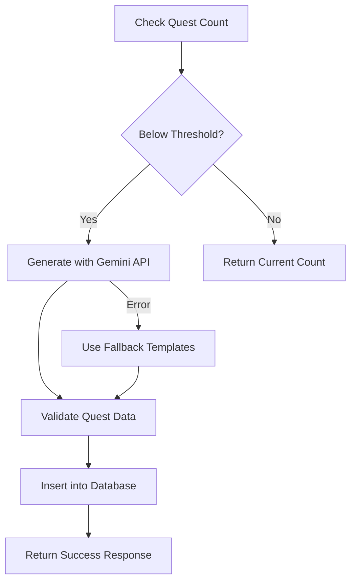

# 🎯 Quest Generation System

This document explains the new AI-powered quest generation system that automatically creates new quests when your database is running low.

## 🚀 Features

- **AI-Powered Generation**: Uses Google's Gemini API to create creative, engaging quests
- **Automatic Detection**: Monitors quest count and generates new ones when needed
- **Fallback System**: Includes predefined quest templates if AI generation fails
- **Data Validation**: Ensures all generated quests meet quality standards
- **Category Diversity**: Generates quests across all categories (scanning, community, recycling, upcycling, profile)

## 📡 API Endpoints

### 1. Automatic Quest Check and Generation
```http
GET /quests/check-and-generate
```

**Description**: Automatically checks current quest count and generates new quests if below threshold.

**Response**:
```json
{
  "success": true,
  "message": "Generated 10 new quests automatically",
  "previous_count": 3,
  "new_count": 13,
  "generated_count": 10
}
```

### 2. Manual Quest Generation
```http
POST /quests/generate
```

**Description**: Manually trigger quest generation with custom parameters.

**Request Body**:
```json
{
  "min_quests": 5,
  "quests_to_generate": 10
}
```

**Response**:
```json
{
  "success": true,
  "message": "Generated 10 new quests",
  "current_count": 15,
  "generated_count": 10,
  "quests": [
    {
      "title": "Eco Warrior Challenge",
      "description": "Scan 15 different recyclable items to become an eco warrior",
      "points": 150,
      "type": "scan",
      "category": "scanning",
      "target_count": 15,
      "icon": "camera-alt",
      "difficulty_level": "medium",
      "is_active": true,
      "is_repeatable": false
    }
  ]
}
```

## 🧠 How It Works

### 1. Quest Generation Process



### 2. AI Prompt Engineering

The system uses carefully crafted prompts to ensure generated quests are:
- **Environmentally focused** and educational
- **Engaging** and fun for users
- **Achievable** but challenging
- **Measurable** with clear objectives
- **Diverse** across all categories

### 3. Data Validation

All generated quests are validated to ensure:
- **Title length**: Max 50 characters
- **Description length**: Max 200 characters
- **Points range**: 25-300 points
- **Target count**: 1-50 items
- **Difficulty levels**: easy, medium, hard
- **Required fields**: All mandatory fields present

## 🗄️ Database Structure

### Quests Collection
```javascript
{
  "id": "quest_123",
  "title": "Eco Warrior Challenge",
  "description": "Scan 15 different recyclable items",
  "points": 150,
  "type": "scan",
  "category": "scanning",
  "target_count": 15,
  "icon": "camera-alt",
  "difficulty_level": "medium",
  "is_active": true,
  "is_repeatable": false,
  "created_at": "2024-01-15T10:30:00Z",
  "updated_at": "2024-01-15T10:30:00Z"
}
```

## 🎨 Quest Categories

### 1. Scanning Quests
- **Icon**: `camera-alt`
- **Types**: scan, identify, categorize
- **Examples**: "Scan 10 plastic bottles", "Identify 5 different materials"

### 2. Community Quests
- **Icon**: `people`
- **Types**: share, post, comment, like
- **Examples**: "Share 3 recycling tips", "Post an upcycling project"

### 3. Recycling Quests
- **Icon**: `recycling`
- **Types**: recycle, collect, sort, dispose
- **Examples**: "Recycle 20 items", "Sort waste for 1 week"

### 4. Upcycling Quests
- **Icon**: `build`
- **Types**: transform, create, craft, repurpose
- **Examples**: "Create 3 upcycled items", "Transform 5 waste items"

### 5. Profile Quests
- **Icon**: `person`
- **Types**: complete, update, verify
- **Examples**: "Complete your profile", "Add your location"

## 🔧 Configuration

### Environment Variables
```bash
# Gemini API Key (already configured in your app.py)
GEMINI_API_KEY=your_api_key_here

# Optional: Customize generation parameters
MIN_QUESTS_THRESHOLD=5
DEFAULT_QUESTS_TO_GENERATE=10
```

### Customization Options

You can modify the generation parameters in `app.py`:

```python
# In generate_quests_with_gemini function
categories = [
    {
        'name': 'your_category',
        'icon': 'your-icon',
        'description': 'Your category description',
        'types': ['type1', 'type2', 'type3']
    }
]

# In check_and_generate_quests function
min_quests = 5  # Minimum threshold
quests_to_generate = 10  # Number to generate
```

## 🧪 Testing

### Run the Test Script
```bash
cd backend
python test_quest_generation.py
```

### Manual Testing with curl
```bash
# Check and auto-generate
curl -X GET https://maxmixy.pythonanywhere.com/quests/check-and-generate

# Manual generation
curl -X POST https://maxmixy.pythonanywhere.com/quests/generate \
  -H "Content-Type: application/json" \
  -d '{"min_quests": 3, "quests_to_generate": 5}'
```

## 🚨 Error Handling

### Common Issues and Solutions

1. **Gemini API Errors**
   - **Cause**: API key issues, rate limits, or network problems
   - **Solution**: System automatically falls back to predefined templates

2. **Database Connection Issues**
   - **Cause**: Firestore connection problems
   - **Solution**: Check Firebase credentials and network connectivity

3. **Invalid Quest Data**
   - **Cause**: AI generates malformed JSON or invalid data
   - **Solution**: Data validation and fallback templates ensure valid quests

### Fallback System

If Gemini API fails, the system uses predefined quest templates:

```python
fallback_templates = {
    'scan': {
        'title': "Scan {count} {category} Items",
        'description': "Use the camera to scan and identify {count} different {category} items.",
        'points': [50, 100, 150],
        'target_count': [5, 10, 15, 20]
    }
    # ... more templates
}
```

## 📊 Monitoring and Analytics

### Quest Generation Metrics
- **Generation success rate**: Track successful vs failed generations
- **Quest diversity**: Monitor category distribution
- **User engagement**: Track completion rates of generated quests
- **AI vs Fallback usage**: Monitor when fallback templates are used

### Logging
The system logs all generation attempts:
```
Generated quest: Eco Warrior Challenge
Inserted quest: Scan 15 Different Materials
Error generating quest with Gemini: API rate limit exceeded
```

## 🔮 Future Enhancements

### Planned Features
1. **User Feedback Integration**: Use user ratings to improve quest quality
2. **Seasonal Quests**: Generate time-sensitive quests for holidays/seasons
3. **Location-Based Quests**: Create quests based on user's geographic location
4. **Difficulty Progression**: Generate quests that match user's skill level
5. **A/B Testing**: Test different quest formats and measure engagement

### Advanced AI Features
1. **Context Awareness**: Generate quests based on user's past behavior
2. **Trending Topics**: Create quests around current environmental trends
3. **Personalization**: Generate quests tailored to individual user preferences
4. **Multi-language Support**: Generate quests in different languages

## 🛠️ Maintenance

### Regular Tasks
1. **Monitor API Usage**: Track Gemini API calls and costs
2. **Review Generated Content**: Periodically check quest quality
3. **Update Templates**: Refresh fallback templates with new ideas
4. **Database Cleanup**: Remove old or unused quests

### Performance Optimization
1. **Caching**: Cache frequently used quest templates
2. **Batch Generation**: Generate multiple quests in single API call
3. **Async Processing**: Use background tasks for quest generation
4. **Database Indexing**: Optimize Firestore queries for quest retrieval

## 📞 Support

For issues or questions about the quest generation system:

1. **Check Logs**: Review backend console output for error messages
2. **Test Endpoints**: Use the test script to verify functionality
3. **Verify Configuration**: Ensure Gemini API key is valid
4. **Database Access**: Confirm Firestore connection is working

---

**Happy Quest Generating! 🎯✨**
